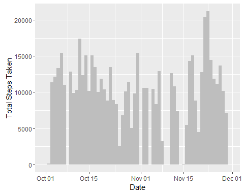
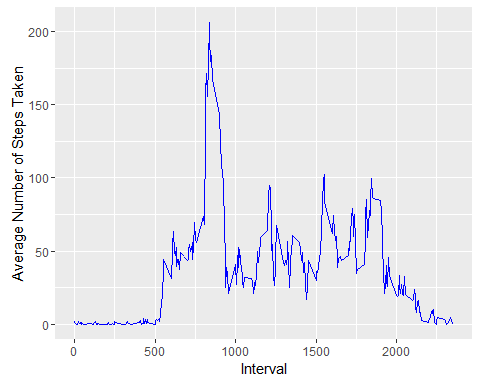

# Reproducible Research: Peer Assessment 1

## Introduction
This is the first of two projects for the Coursera Reproducible Research course.  This purpose of this assignment is to create several analyses and visualizations of a personal movement data set collected by an activity monitoring device. These analyses/visualizations are given below in the sections specified by the instructions and the project template upon which this report has been built. 

## Loading and preprocessing the data

Before starting, we'll load some libraries that will be used in the main sections below as well as set the current working directory:


```r
library(plyr)
library(ggplot2)

# Set the current working directory to where there data file will be
setwd('C:/Coursera Courses/Reproducible Research/Course Projects/Course Project 1/RepData_PeerAssessment1')
```

***

#### 1. Load the data
First we'll read in the data which is in a .csv file located in the working directory: 


```r
activityDS <- read.csv('activity.csv', stringsAsFactors = FALSE)
```

*****

#### 2. Process/transform the data if necessary
Next we quickly check the types of each one of the columns of the dataset:


```r
str(activityDS)
```

```
## 'data.frame':	17568 obs. of  3 variables:
##  $ steps   : int  NA NA NA NA NA NA NA NA NA NA ...
##  $ date    : chr  "2012-10-01" "2012-10-01" "2012-10-01" "2012-10-01" ...
##  $ interval: int  0 5 10 15 20 25 30 35 40 45 ...
```

Since the date column comes up as an integer, we'll explicitly cast it back to a date and everything else in the dataset should be good for now:


```r
activityDS$date <- as.Date(activityDS$date)
```

*****

## What is mean total number of steps taken per day?

#### 1. Make a histogram of the total number of steps taken each day

```r
ggplot(activityDS) + 
  geom_histogram(aes(x=date, weight=steps), binwidth = 1, fill="gray") +
  xlab("Date") + ylab("Total Steps Taken")
```

<div class="figure" style="text-align: center">

<p class="caption">Figure 1: Total Steps Taken Per Day</p>
</div>

*****

#### 2. Calculate and report the mean and median total number of steps taken per day
First we need to build a new dataset with the daily step totals using the original dataset:


```r
CalcDailyStepTotals <- function(activities)
{
  date <- activities[0, "date"]
  totalSteps <- sum(activities$steps, na.rm = TRUE)
  
  newRow <- c(date = date, totalSteps = totalSteps)
  newRow
} # CalcDailyStepTotals

dailyStepTotalsDS <- ddply(activityDS, .variables = "date", .fun = CalcDailyStepTotals)
dailyStepTotalsDS$totalSteps <- as.integer(dailyStepTotalsDS$totalSteps)
```

Next using the new dataset created above, calculate and print the mean and median of the total steps:


```r
meanTotalStepsPerDay <- mean(dailyStepTotalsDS$totalSteps, na.rm = TRUE)
print(sprintf("Mean Total Steps Per Day = %7.2f", meanTotalStepsPerDay))
```

```
## [1] "Mean Total Steps Per Day = 9354.23"
```

```r
medianTotalStepsPerDay <- median(dailyStepTotalsDS$totalSteps, na.rm = TRUE)
print(sprintf("Median Total Steps Per Day = %d", medianTotalStepsPerDay))
```

```
## [1] "Median Total Steps Per Day = 10395"
```

*****

## What is the average daily activity pattern?

#### 1. Make a time series plot of the 5-minute interval and the average number of steps taken, averaged across all days

First we'll need to create a new dataset from the original, this time one that takes the average of steps taken across all days for each 5-minute interval:
`

```r
# Calculate the average number of steps per interval across all days
CalcIntervalAvgSteps <- function(activities)
{
  interval <- activities[0, "interval"]
  avgSteps <- mean(activities$steps, na.rm = TRUE)
  
  newRow <- c(interval = interval, avgSteps = avgSteps)
  newRow
} # CalcIntervalAvgSteps

intervalStepAvgsDS <- ddply(activityDS, .variables = "interval", .fun = CalcIntervalAvgSteps)
```

Using the new dataset, we now plot the average number of steps taken across all days for each 5-minute interval


```r
# Now plot the interval (x-axis) vs the number of steps averaged across all days
ggplot(intervalStepAvgsDS, aes(x=interval, y=avgSteps)) + geom_line(color="blue") +
  xlab("Interval") + ylab("Average Number of Steps Taken")
```

<div class="figure" style="text-align: center">

<p class="caption">Figure 2: Average Number of Steps Taken Per 5-Minute Interval</p>
</div>

*****


#### 2. Which 5-minute interval, on average across all the days in the dataset, contains the maximum number of steps?

Using the new dataset created above, we can now calculate during which intervals the most steps were taken, on average, across all the days:


```r
# Now find and print the interval with the maximum daily average number of steps
maxStepIntervalIndex <- which.max(intervalStepAvgsDS$avgSteps)
maxInterval <- intervalStepAvgsDS[maxStepIntervalIndex, "interval"]
maxAvgSteps <- intervalStepAvgsDS[maxStepIntervalIndex, "avgSteps"]
print(sprintf("Interval %d has the maximum number of average steps at %7.2f", maxInterval, maxAvgSteps))
```

```
## [1] "Interval 835 has the maximum number of average steps at  206.17"
```

*****

## Imputing missing values

#### 1. Calculate and report the total number of missing values in the dataset


```r
# Calculate and print total number of rows with missing values
numMissingRows <- sum(is.na(activityDS))
print(sprintf("The number of missing rows in the activity dataset = %d", numMissingRows))
```

```
## [1] "The number of missing rows in the activity dataset = 2304"
```

*****

#### 2. Devise a strategy for filling in all of the missing values in the dataset

As there are some days with data completely missing, the strategy that seems to work best is to simply replace any missing values with the average for that interval across all days.

*****

#### 3. Create a new dataset that is equal to the original dataset but with the missing data filled in
We now create a new dataset where missing values are substituted with the average for that interval:

```r
FixMissingSteps <- function(originalValue, interval, avgStepsDS)
{
  intervalIndex <- which(avgStepsDS$interval == interval)
  avgStepsForInterval <- avgStepsDS[intervalIndex, "avgSteps"]
  #If a value is missing, use the average steps for that interval, otherwise take the original value
  fixedStepsValue <- ifelse(is.na(originalValue), round(avgStepsForInterval), originalValue)
  as.integer(fixedStepsValue)
} # end FixMissingSteps

fixedActivityDS <- activityDS
fixedActivityDS$steps <- apply(activityDS, 1, function(activityRec) FixMissingSteps(as.integer(activityRec["steps"]), as.integer(activityRec["interval"]), intervalStepAvgsDS))
```

*****

#### 4. Make a histogram of the total steps taken each day and calculate and report the mean and median total number of steps taken per day


```r
ggplot(fixedActivityDS) + 
  geom_histogram(aes(x=date, weight=steps), binwidth = 1, fill="gray") +
  xlab("Date") + ylab("Total Steps Taken")
```

<div class="figure" style="text-align: center">

<p class="caption">Figure 3: Total Steps Taken Per Day with Missing Values Fixed</p>
</div>

We again build a new dataset which calculates the daily step totals, this time using the new activity dataset with the missing values fix.  
__NOTE:__ *The code for the function called by ddply (CalcDailyStepTotals) is given in an earlier section of this report*


```r
fixedDailyStepTotalsDS <- ddply(fixedActivityDS, .variables = "date", .fun = CalcDailyStepTotals)
fixedDailyStepTotalsDS$totalSteps <- as.integer(fixedDailyStepTotalsDS$totalSteps)
```

Using this dataset, we now calculate the mean and median total number of steps taken per day


```r
fixedMeanTotalStepsPerDay <- mean(fixedDailyStepTotalsDS$totalSteps)
fixedMedianTotalStepsPerDay <- median(dailyStepTotalsDS$totalSteps)

print(sprintf("Missing Values Fixed Mean Total Steps Per Day = %7.2f", fixedMeanTotalStepsPerDay))
```

```
## [1] "Missing Values Fixed Mean Total Steps Per Day = 10765.64"
```

```r
print(sprintf("Missing Values Fixed Median Total Steps Per Day = %d", fixedMedianTotalStepsPerDay))
```

```
## [1] "Missing Values Fixed Median Total Steps Per Day = 10395"
```

#### __Question:__*Do these values differ from the estimates from the first part of the assignment?*
Comparing the mean and median of the dataset with the fixed missing values to those of the original dataset (i.e. with missing values), we get the following:


```r
print(sprintf("Missing Values Fixed Mean Total Steps Per Day = %7.2f, compared to %7.2f for the original dataset with missing values", fixedMeanTotalStepsPerDay, meanTotalStepsPerDay))
```

```
## [1] "Missing Values Fixed Mean Total Steps Per Day = 10765.64, compared to 9354.23 for the original dataset with missing values"
```

```r
print(sprintf("Missing Values Fixed Median Total Steps Per Day = %d, compared to %d for the original dataset with missing values", fixedMedianTotalStepsPerDay, medianTotalStepsPerDay))
```

```
## [1] "Missing Values Fixed Median Total Steps Per Day = 10395, compared to 10395 for the original dataset with missing values"
```

As shown above, YES the MEAN is different from the first part of the assignment (it is greater), but NO the MEDIAN is NOT different, it is the same.

*****

#### __Question:__*What is the impact of imputing missing data on the estimates of the total daily number of steps?*

Comparing the total steps from the dataset with the missing values fixed to the original dataset, we get the following:


```r
numDifferentValues <- sum(fixedDailyStepTotalsDS$totalSteps != dailyStepTotalsDS$totalSteps)
print(sprintf("The total daily steps in the dataset where missing values are fixed differs from the original %d times.", numDifferentValues))
```

```
## [1] "The total daily steps in the dataset where missing values are fixed differs from the original 8 times."
```

*****

## Are there differences in activity patterns between weekdays and weekends?

#### 1. Create a new factor variable in the datset with two levels - "weekday" and "weekend" indicating whether a given date is a weekday or weekend day

The new variable we'll create here will be called "dayType" as shown in the code given below:


```r
weekendDays <- c("Saturday", "Sunday")
fixedActivityDS$dayType <- ifelse(weekdays(fixedActivityDS$date) %in% weekendDays, "weekend", "weekday")
fixedActivityDS$dayType <- as.factor(fixedActivityDS$dayType)

summary(fixedActivityDS$dayType)
```

```
## weekday weekend 
##   12960    4608
```


*****


#### 2. Make a panel plot containing a time series plot of the 5-minute interval (x-axis) and the average number of steps taken, averaged across all weekday or weekend days (y-axis)

First we need to create a new dataset that calculates the average number of steps per interval across week and weekend days separately:


```r
CalcIntervalAvgStepsDayType <- function(activities)
{
  interval <- activities[0, "interval"]
  dayType <- activities[0, "dayType"]
  avgSteps <- mean(activities$steps, na.rm = TRUE)
  
  newRow <- c(interval = interval, dayType = dayType, avgSteps = avgSteps)
  newRow
} # CalcIntervalAvgStepsDayType

fixedIntervalStepAvgsDS <- ddply(fixedActivityDS, .variables = c("interval", "dayType"), .fun = CalcIntervalAvgStepsDayType)
```

With the new dataset, we then create the requested time series panel plot:


```r
# Make a panel plot of the time series of weekends vs. weekdays.
ggplot(fixedIntervalStepAvgsDS, aes(x=interval, y=avgSteps)) + 
  geom_line(aes(color=dayType)) + 
  facet_wrap(~dayType, dir = "v") +
  xlab("Interval") + ylab("Average Number of Steps Taken")
```

<div class="figure" style="text-align: center">

<p class="caption">Figure 4: Average Number of Steps Taken Per 5-Minute Interval</p>
</div>


